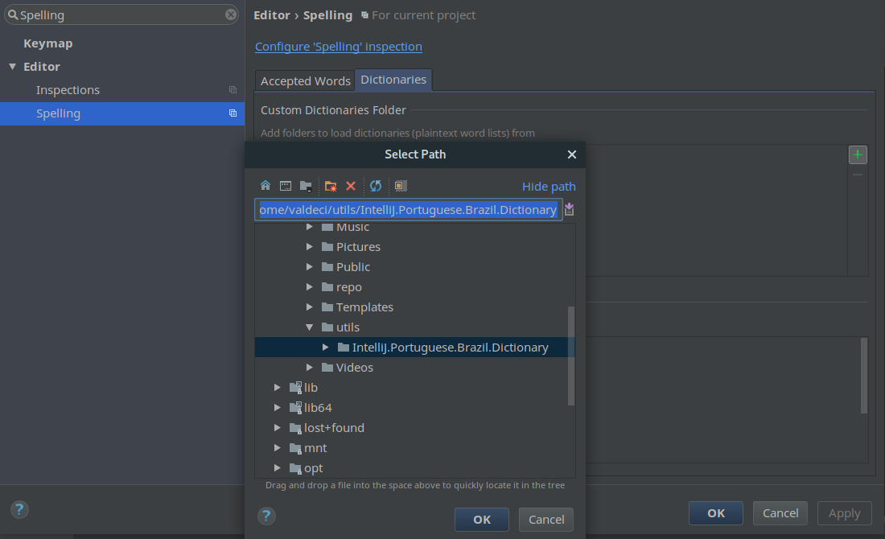

IntelliJ Portuguese-Brazil Dictionary
=====================================

Esse é um dicionario em português do Brasil (pt-BR) para corretor ortográfico do JetBrains IntelliJ IDEA ([http://www.jetbrains.com/idea/](http://www.jetbrains.com/idea/ "JetBrains IntelliJ IDEA")).

This is a Brazilian Portuguese (pt-BR) dictionary for the spell checker of JetBrains IntelliJ IDEA ([http://www.jetbrains.com/idea/](http://www.jetbrains.com/idea/ "JetBrains IntelliJ IDEA")).

## Instalação

Para instalar o dicionario na sua IDE, vá para o menu **Preferences > Editor > Spelling** (ou pesquise **Spelling** na so search Box no menu Preferences) em qualquer umas da IDEs da IntelliJ.

No menu **Spelling**, selecione a aba *Dictionaries* e clique na opção **+** para adicionar a pasta do dicionario baixado, conforme a imagem abaixo:  

Após isso, o seu dicionário estará instalado com sucesso!

----------

More info at IntelliJ spellchecking Help [http://www.jetbrains.com/idea/webhelp/spellchecking.html](http://www.jetbrains.com/idea/webhelp/spellchecking.html "IntelliJ IDEA - Spellchecking")

----------
rafaelsc
